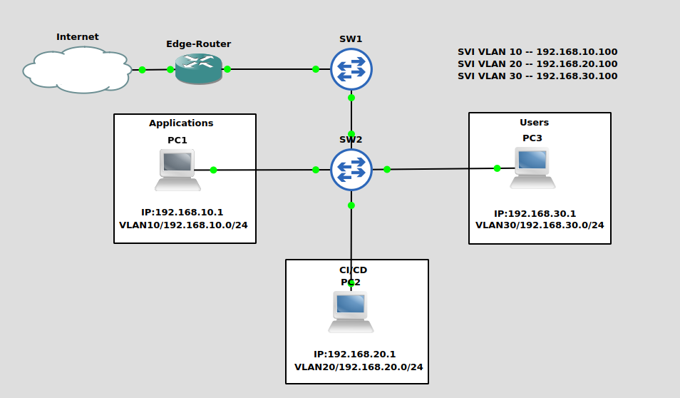

# AzureNestCDISLab
Homelab emulated using a GNS3 VM on Azure that was made to deploy my CDIS (DevOps) personal project. 

WIP to shift from Minikube -> Kubernetes to allow deployment accross mutiple VLANs

## VLANs
 + Applications: app.py, data_generator, data_processor
 + CI/CD: Jenkins, Kubernetes, Helm, Zookeeper, Kafka
 + User: User accessing

## Components
 + Cisco 3725 
 + viosl2-adventerprisek9
 + Ubuntu Linux

